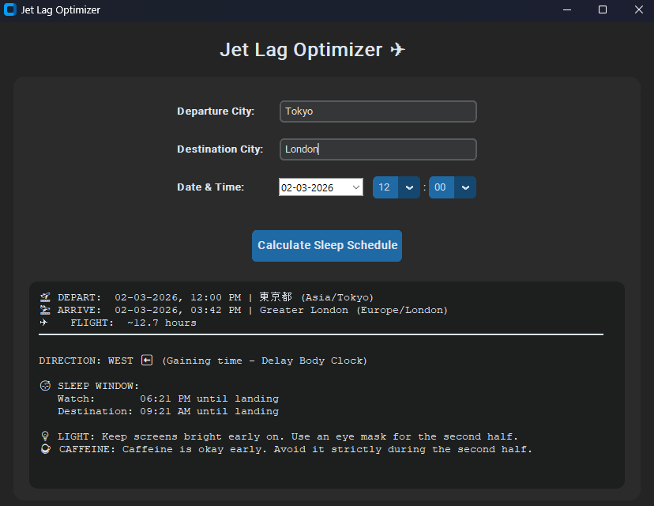

# ✈️ Jet Lag Optimizer

A modern Python desktop application designed to help travelers minimize jet lag. By analyzing your flight's departure and destination cities, the app calculates time zone shifts and generates a personalized bio-hacking schedule for sleep, light exposure, and caffeine intake.

## Features

- **Smart City Lookup:** Enter any major city in the world. The app automatically fetches its exact GPS coordinates and local time zone.
- **Flight Time Estimation:** Uses the Haversine formula to calculate the distance between your cities and estimates the total flight duration.
- **Actionable Strategies:** Tells you exactly when to sleep, when to drink coffee, and when to use an eye mask based on whether you are traveling East (phase advance) or West (phase delay).
- **Modern UI:** Built with `customtkinter` for a sleek, responsive, and dark-mode-enabled interface.

## Prerequisites & Installation

To run this application from the source code, you will need Python 3 installed on your machine.

1. Clone this repository:
   `git clone [https://github.com/Kndy26/jetlag-optimizer.git](https://github.com/Kndy26/jetlag-optimizer.git)`
   `cd jetlag-optimizer`

2. Install the required external Python libraries:
   `pip install customtkinter tkcalendar geopy timezonefinder pytz`

## Usage

Run the main Python script from your terminal:
`python jetlag_gui.py`

- Enter your Departure City and Destination City (e.g., "Jakarta", "Tokyo").
- Select your departure date and time using the built-in calendar and dropdowns.
- Click Calculate Sleep Schedule to generate your flight itinerary and jet lag strategy.

## Built With

- [CustomTkinter](https://github.com/TomSchimansky/CustomTkinter) - UI Framework
- [GeoPy](https://geopy.readthedocs.io/) - Geocoding API
- [TimezoneFinder](https://timezonefinder.readthedocs.io/) - Offline timezone lookup

## Screenshots

